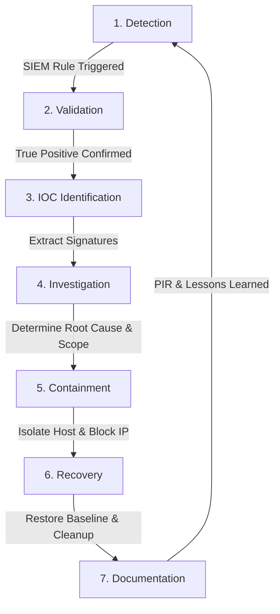

# PHASE 6: Defensive Incident Response (IR) Workflow

---

## 1. Overview of Phase 6
Incident Response (IR) is the organized defensive approach to addressing and managing the aftermath of a security breach or cyberattack.

In this phase, we map our lab detections to an industry-standard **7-Stage Defensive Workflow** aligned with **NIST SP 800-61** and **SANS PICERL** frameworks:



---

## 2. Stage-by-Stage Defensive Workflow

### Stage 1: Detection
- **What occurs:** Telemetry collected from the Windows endpoint (via Sysmon and Windows Event logs) is analyzed in real-time by the Wazuh Manager engine.
- **Lab Application:**
  - Sysmon Event ID 3 detected an outbound TCP socket connection to `203.0.113.50:443`.
  - Wazuh Rule `100001` evaluated the destination IP against our threat intelligence list and escalated a **Level 12 (Critical)** alert.

---

### Stage 2: Validation (Triage)
- **Objective:** Determine if the alert represents a **True Positive (TP)** requiring escalation or a **False Positive (FP)** caused by benign business operations.
- **Triage Checklist:**
  1. *Is the destination IP legitimate business infrastructure?* Verified `203.0.113.50` against internal asset inventories. It is not an authorized cloud service.
  2. *Was the connection initiated by an authorized administrator?* The process was `powershell.exe` spawned without a change ticket.
  3. *Result:* Alert validated as a **Confirmed True Positive (Simulated Intrusion)**.

---

### Stage 3: IOC Identification
- **Objective:** Extract actionable technical signatures from the telemetry payload to prevent further spread across the network.
- **Identified Indicators from Lab Telemetry:**
  - **Network Indicator (C2 IP):** `203.0.113.50:443`
  - **File Indicator (Dropper Name):** `invoice_malware_sim.exe`
  - **Hash Indicator (SHA256):** `4a1b025fbc77660c6753a798a69eef52467d302a281898114f6d4d161d713c23`
  - **Behavioral Indicator (TTP):** Base64 encoded PowerShell invocation (`-EncodedCommand`).

---

### Stage 4: Investigation (Deep Forensic Analysis)
- **Objective:** Establish the full attack narrative, timeline, and blast radius.
- **Key Questions Answered by SOC Analyst:**
  - *Where did it start?* Traced to user account `WIN-ENDPOINT-01\socadmin`.
  - *What files were touched?* Wazuh FIM records confirmed that only files within `C:\SOC_Lab_Test\` were affected. Critical OS paths (`C:\Windows\System32\drivers\etc`) remained unchanged.
  - *Did persistence establish?* Checked registry run keys (`HKLM\Software\Microsoft\Windows\CurrentVersion\Run`). No persistence keys were created.
  - *Are other endpoints affected?* SIEM search across all agent IDs confirmed no other machine communicated with `203.0.113.50`.

---

### Stage 5: Containment Recommendation & Execution
- **Objective:** Stop the attacker's progression and prevent data exfiltration without destroying forensic evidence.
- **Short-Term Containment Actions:**
  1. **Host-Level Firewall Rule:** Immediately block all outbound communication to IP `203.0.113.50`.
  2. **File Quarantine:** Relocate `invoice_malware_sim.exe` out of the working directory into an isolated, restricted quarantine vault (`C:\SOC_Lab_Quarantine`).
  3. **Process Termination:** Terminate the initiating PowerShell process ID if still active.

#### Automated Execution in Lab:
We executed our defensive script [containment_simulation.ps1](file:///d:/Cyber%20project/scripts/containment_simulation.ps1) in PowerShell (Admin):
```powershell
powershell -ExecutionPolicy Bypass -File "d:\Cyber project\scripts\containment_simulation.ps1"
```
*Result:* Host firewall block rule `SOC_LAB_BLOCK_MALICIOUS_C2_TEST_IP` active; dropper moved to quarantine.

---

### Stage 6: Recovery Recommendation
- **Objective:** Restore compromised systems safely to normal business operations.
- **Actions Performed:**
  1. **Artifact Removal:** Safely delete benign simulation files (`test_ransom_note.txt`).
  2. **Baseline Re-verification:** Run a forced Wazuh FIM scan to ensure no unauthorized files remain:
     ```powershell
     # In PowerShell on Windows:
     Restart-Service -Name "WazuhSvc"
     ```
  3. **Account Review:** Audit local administrator privileges to verify no shadow accounts were generated.

---

### Stage 7: Documentation & Lessons Learned (Post-Incident Review)
- **Objective:** Document findings for compliance, audit, and SOC knowledge base enhancement.
- **Key Outcomes:**
  1. The incident investigation was compiled into our [incident_investigation_dossier.md](file:///d:/Cyber%20project/report/incident_investigation_dossier.md).
  2. **Detection Rule Improvement:** Detection Rule `100001` proved effective with zero lag. Recommended adding automated firewall response scripts (Wazuh Active Response) for instant automatic IP blocking in future versions.
